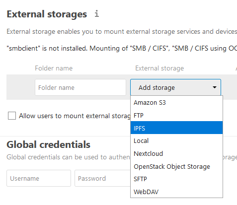

# IPFS for Nextcloud

This app allows you to use IPFS as an external storage for Nextcloud.

_Place this app in **nextcloud/apps/**_

## Shortcomings
- unless you create a private IPFS swarm all files will be public
- timestamps don't work correctly since IPFS doesn't have timestamps yet
- has some problems writing files some related to the timestamp issue

## Documentation
- **[Getting Started](docs/README.md)**
- [Changelog](CHANGELOG.md)

