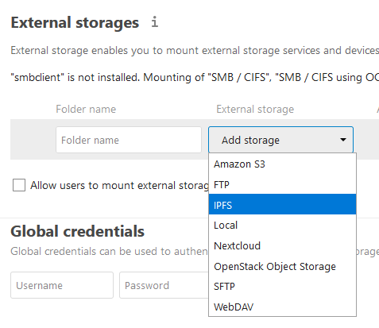
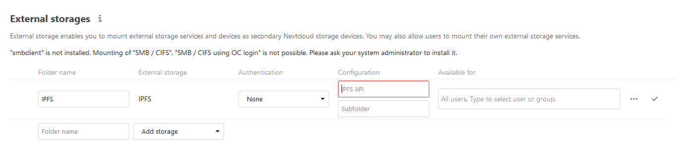

# Documentation
- [Testing](./Testing.md)

## Installation
### Prerequesites
- [Nextcloud](https://nextcloud.com/) duh?
- a working [IPFS Node](https://ipfs.io/#install)

First clone this repo to the `apps` folder of your Nextcloud instance. And for now thats how easy it is to setup if you have the prerequsites.

## Usage

If the IPFS node is running locally the `IPFS API` should be `127.0.0.1:5001/api/v0/`. `Subfolder` is the root path on the node, where all document will be stored. If left empty it will just use the root storage of the IPFS node. *Currently the folder will not get auto created so you will have to do that yourself.*