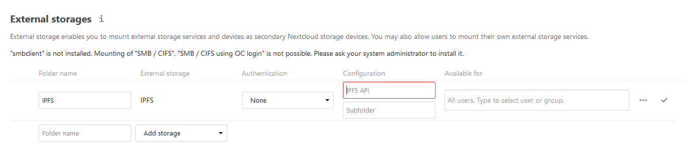

# Documentation
- [Testing](Testing.md) *How to properly do tests (__TODO__)*
- [Storage](Storage.md) *Where are your files stored on IPFS*

## Installation
### Prerequesites
- [Nextcloud](https://nextcloud.com/) *duh?*
- a working [IPFS Node](https://ipfs.io/#install) (js-ipfs >= 0.41 | go-ipfs >= *? Not yet available*)

Then clone this repo to the `apps` folder of your Nextcloud instance. And enable it in your nextcloud.

## Usage

If the IPFS node is running locally the `IPFS API` should be `http://127.0.0.1:5001/api/v0`.
`Subfolder` is the root path on the node, where all documents will be stored.
If left empty it will just use the root storage of the IPFS node. *See also: [Storage](Storage.md)*